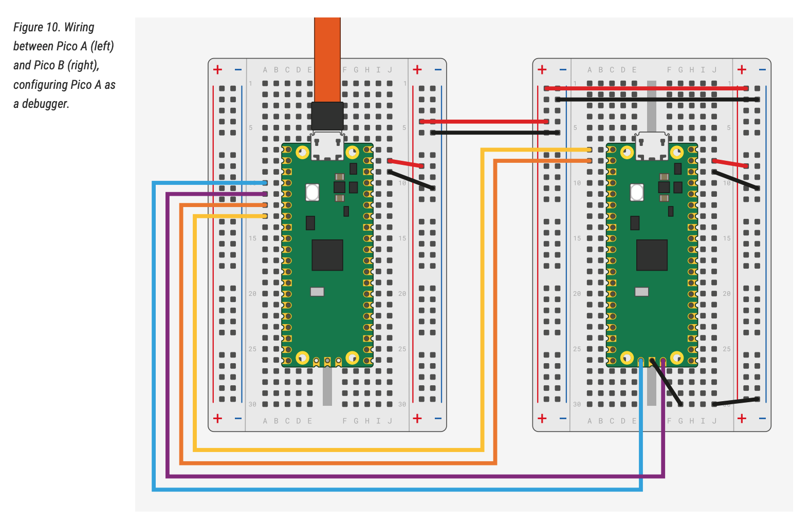

# Bare Metal ARM Assembly with Raspberry Pi RP2350

Nothing but bare-metal native ARM assembly codes.

## Directories

### Examples

This folder contains various native ARM code examples for Raspberry Pi Pico 2 W (RP2350).

### RP2350

This folder contains common include files for RP2350 ARM assembly programming.

## How to debug RP2350 Assembly with OpenOCD and VS Code

(June 9, 2025) It took me a while to figure out how to setup debugging environment with OpenOCD and VS Code. The followings are the steps I had to take and hope it doesn't take long for you.

I used **Two Pico 2 W** one as debug probe and another as target containing program I wrote. 

1. Install Arm tool chain from below link.

    https://developer.arm.com/downloads/-/arm-gnu-toolchain-downloads

1. Export the tool chain path where arm-none-eabi-as is installed.

    For my macOS, it was installed in the below path:
    ```
    export PATH=$PATH:/Applications/ArmGNUToolchain/14.2.rel1/arm-none-eabi/bin
    ```

1. Clone latest Pico SDK.

    ```console
    $ git clone https://github.com/raspberrypi/pico-sdk.git
    ```
    This will create pico-sdk folder. PICO_SDK_PATH needs to be expoerted as environment variable. This is needed for later.

    ```console
    export PICO_SDK_PATH=/path/to/pico-sdk
    ```


1. Clone latest debugprobe.

    ```console
    $ git clone https://github.com/raspberrypi/debugprobe.git
    ```
    This will create debugprobe folder.

1. Build the latest debugprobe.

    ```console
    $ cd debugprobe
    $ git submodule update --init --recursive
    ```
    This will clone submodules needed for the debugprobe. Now, let's build the debugprobe.

    ```console
    $ mkdir build
    $ cd build
    $ cmake -DDEBUG_ON_PICO=1 -DPICO_BOARD=pico2 -DPICO_PLATFORM=rp2350 ../
    ```
    It should complete cmake command without any warning or errors. If there is an error, it could be that it's missing some dependencies like Python 3.

    Last step here is build it.

    ```console
    $ make
    ```
    There could be a warning but it doesn't really matter. If you are missing a dependency, it would show some error message and hopefully you could find how to resolve it from quick web search.

    You will see the last command line output showing debugprobe_on_pico2.elf was created.
    ```console
    [100%] Linking CXX executable debugprobe_on_pico2.elf
    [100%] Built target debugprobe
    ```

    In the same folder, you will find ```debugprobe_on_pico2.uf2``` and that is the binary you need to flash to the Pico 2W you want to use as debug probe. Now you have debug probe on your Pico 2W!

1. Build the 002.Blink which I already added debug option. This will be needed later when you attach debugger from VS code.

    ```console
    $ cd example/002.blink
    $ make
    ```
    You will find ```blink.uf2``` in bin directory. Now you have application you can debug through.

1. Clone OpenOCD provided by Raspberry Pi

    ```console
    $ git clone https://github.com/raspberrypi/openocd.git
    ```
    You need to have aclocal libtool, pkg-config, automake to build this (at least for my macos). If something else is missing, it will be mentioned as part of build steps below.

1. Build OpenOCD

    ```console
    $ cd openocd
    $ ./bootstrap
    ```
    If you missed something, bootstrap will complain about it. I found it was easy to install them with brew on macOS.

    ```console
    $ ./configure --disable-werror
    $ make -j4
    ```
    Now you have openocd in your dev machine.

1. Wiring target Pico 2W with debug probe Pico 2W.
    
    Before starting OpenOCD, the target Pico 2W needs to be wired to Pico 2W. The below image shows how to wire them. This is from ["Getting started with Raspberry Pi Pico-series"](https://datasheets.raspberrypi.com/pico/getting-started-with-pico.pdf)

    

    ```
    DebugProbe GND -> Target GND
    DebugProbe GP2 -> Target SWCLK
    DebugProbe GP3 -> Target SWDIO
    DebugProbe GP4/UART1 TX -> Target GP1/UART0 RX
    DebugProbe GP5/UART1 RX -> Target GP0/UART0 TX
    ```

    Just an additional note, Pico 2 W has these debug pins in the middle of board just above the wireless chip (shiny metal retangle box). I had to solder for the first time in my life to add 3 pin header there so that I can connect to debug probe's pins. It was not so bad.

    USB power is only needed to the debug probe but before that you may want to flash the target Pico 2 W with the program that you want to debug. Basically, power is provided from debug probe to the target so essentially it will boot up and start running your assembly program.

    Now we are almost there.

1. Start OpenOCD

    You can start OpenOCD now. Go back to the openocd folder.

    ```console
    $ src/openocd -s tcl -f tcl/interface/cmsis-dap.cfg -f tcl/target/rp2350.cfg -c "adapter speed 5000"
    ```

    You will see some output in the command line. You will see below at the end of output:

    ```
    Info : Listening on port 3333 for gdb connections
    ```
    You can stop it now.
    
1. Setting up VS Code

    Setting up VS code is relative easy. If you haven't, install VS code.

    ```
    https://code.visualstudio.com/download
    ```

1. Install Cortex-Debug extension

1. In your workspace, you need to set two files under .vscode folder.

    ```
    [settings.json]

    {
        "cortex-debug.openocdPath": "/Path/to/openocd/src/openocd",
    }
    ```
    Note that it is full path including the command "openocd".

    ```
    [launch.json]
    {
        "version": "0.2.0",
        "configurations": [
            {
                "name": "Coretex Debug",
                "type": "cortex-debug",
                "executable": "${workspaceFolder}/examples/002.Blink/bin/blink.elf",
                "request": "launch",
                "servertype": "openocd",
                "device": "RP2350",
                "configFiles": [
                    "/Path/to/openocd/tcl/interface/cmsis-dap.cfg",
                    "/Path/to/openocd/tcl/target/rp2350.cfg"
                ],
                "searchDir": ["/Path/to/openocd/tcl"],
                "svdFile": "/Path/to/pico-sdk/src/rp2350/hardware_regs/RP2350.svd",
                "gdbTarget": "localhost:3333",
                "showDevDebugOutput": "vscode"
            }
        ]
    }
    ```
    This one is little longer. Just watch out for the path you are providing. It requires your executable path where elf file is avaialble. It requires openocd full path where interface and target files are available. It also requires svd file from pico-sdk.

    Once you have done it, it's all set!

1. Put a break point in VS code
    
    

1. And press F5! which will start debug sessions.

    


## References

1. Raspberry Pi Ltd, [RP2350 Datasheet: A microcontroller by Raspberry Pi](https://datasheets.raspberrypi.com/rp2350/rp2350-datasheet.pdf)
1. Raspberry Pi Ltd, [Raspberry Pi Pico SDK](https://github.com/raspberrypi/pico-sdk)
1. Raspberry Pi Ltd, [Getting started with Raspberry Pi Pico-series](https://datasheets.raspberrypi.com/pico/getting-started-with-pico.pdf)
## Trademark Notice

**ARM®** is a registered trademark of Arm Limited (or its subsidiaries) in the US and/or elsewhere. This project is an independent effort and is not affiliated with, nor endorsed by Arm Limited.

**Raspberry Pi®** and **Pico®** are registered trademarks of Raspberry Pi Ltd. RP2350 is a product of Raspberry Pi Ltd. This project is an independent effort and is not affiliated with, nor endorsed by Raspberry Pi Ltd.
